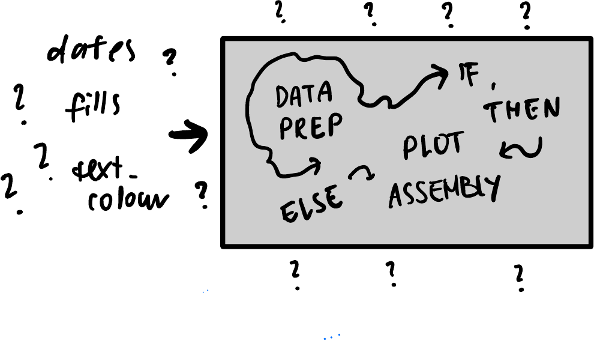

## What makes for a 'good' plot helper?


::: {.notes}
this talk is not about calendars, but about some strong opinions I developed about writing helper functions, that might help you next time you're trying to reuse ggplot2 code
:::

# Hasn't someone else already solved the calendar problem?

## ... but I want a monthly layout!

<!-- Convenience vs. flexibility -->

::: {.columns}
::: {.column}

```{r}
#| echo: true
#| eval: true
#| output-location: fragment
library(ggweekly)
ggweek_planner(
  start_day = "2019-04-01", 
  end_day = "2019-06-30", 
)
```
:::
::: {.column .small .fragment}

What about customisation?

```{.r code-line-numbers="|11-13|14-16|18-20|17"}
ggweekly::ggweek_planner(
    start_day = lubridate::today(),
    end_day = start_day +
        lubridate::weeks(8) - lubridate::days(1),
    highlight_days = NULL,
    week_start = c("isoweek", "epiweek"),
    week_start_label = c("month day", "week", "none"),
    show_day_numbers = TRUE,
    show_month_start_day = TRUE,
    show_month_boundaries = TRUE,
    highlight_text_size = 2,
    month_text_size = 4,
    day_number_text_size = 2,
    month_color = "#f78154",
    day_number_color = "grey80",
    weekend_fill = "#f8f8f8",
    holidays = ggweekly::us_federal_holidays,
    font_base_family = "PT Sans",
    font_label_family = "PT Sans Narrow",
    font_label_text = NULL
)
```
:::
:::

::: aside
Example from [`github.com/gadenbuie/ggweekly`](https://github.com/gadenbuie/ggweekly)
:::

## Similar function, different wrapper?

::: {.columns}
::: {.column .small}
```{r}
#| echo: true
#| eval: true
#| output-location: default
library(ggcal)

mydate <- 
  seq(
    as.Date("2017-02-01"),
    as.Date("2017-07-22"),
    by="1 day")
myfills <- 
  rnorm(length(mydate))

print(ggcal(mydate, myfills))
```
:::
::: {.column .big .fragment}

* how many arguments does `ggcal()` have?
* what format should `dates`, `fills` be?

:::
:::

::: aside
Example from [`github.com/jayjacobs/ggcal`](https://github.com/jayjacobs/ggcal/)
:::

## Another helpful calendar maker?

::: {.columns}
::: {.column}
```{.r}
calendR(
    year = format(Sys.Date(), "%Y"),
    month = NULL,
    from = NULL,
    to = NULL,
    start = c("S", "M"),
    orientation = c("portrait", "landscape"),
    title,
    title.size = 20,
    title.col = "gray30",
    subtitle = "",
    subtitle.size = 10,
    subtitle.col = "gray30",
    text = NULL,
    text.pos = NULL,
    text.size = 4,
    text.col = "gray30",
    special.days = NULL,
    special.col = "gray90",
    gradient = FALSE,
    low.col = "white",
    col = "gray30",
    lwd = 0.5,
    lty = 1,
    font.family = "sans",
    font.style = "plain",
    day.size = 3,
    days.col = "gray30",
    weeknames,
    weeknames.col = "gray30",
    weeknames.size = 4.5,
    week.number = FALSE,
    week.number.col = "gray30",
    week.number.size = 8,
    monthnames,
    months.size = 10,
    months.col = "gray30",
    months.pos = 0.5,
    mbg.col = "white",
    legend.pos = "none",
    legend.title = "",
    bg.col = "white",
    bg.img = "",
    margin = 1,
    ncol,
    lunar = FALSE,
    lunar.col = "gray60",
    lunar.size = 7,
    pdf = FALSE,
    doc_name = "",
    papersize = "A4"
)
```
:::
::: {.column .big style="text-align: center"}
* Is this using ggplot2?
* What are the inputs?
* Internal data preparation?
* ...?
:::
:::

::: aside
Example from [`github.com/R-CoderDotCom/calendR`](https://github.com/R-CoderDotCom/calendR)
:::

## Adding new grammar components? {visibility="hidden"}

::: {.columns}
::: {.column}

<iframe src="https://mjskay.github.io/ggdist/" width="100%" height="500px" style="border: 1px solid #ccc; border-radius: 8px;"></iframe>

:::
::: {.column .fragment}
Special data semantics need special handling:

  * time: `ggweekly`, `ggcal`, `CalendR`... `ggtime` (WIP)
  * variation & uncertainty: `ggdist`, [`ggdibbler`](https://harriet-mason.github.io/ggdibbler/articles/ggdibbler-vignette.html)
  * space: `sf`
:::
:::

## Expose: Keeping the magic 📊 

::: {.smaller}

:::

<!-- ## Grammar-based data visualisation

::: {.sketch-container}
{fig-align="center"}
::: -->

## Modular: Layered Grammar of Graphics ➕ {visibility="hidden"}
::: {.columns}
::: {.column width="60%"}


:::
::: {.column .small .fragment width="40%"}

```{r}
#| echo: true
#| eval: true
#| code-line-numbers: "2|3-5|6|7|8"
#| output-location: fragment
ggplot(
  data = penguins, 
  mapping = aes(x = bill_length_mm,
                y = bill_depth_mm,
                color = species)) +
  geom_point() +
  theme_bw()
```

:::
:::

## {.visibility="hidden"}

::: {.sketch-container}
{fig-alt="Arguments for dates, fills and text colour disappearing into an opaque box that hides data prep and plot assembly"}
:::