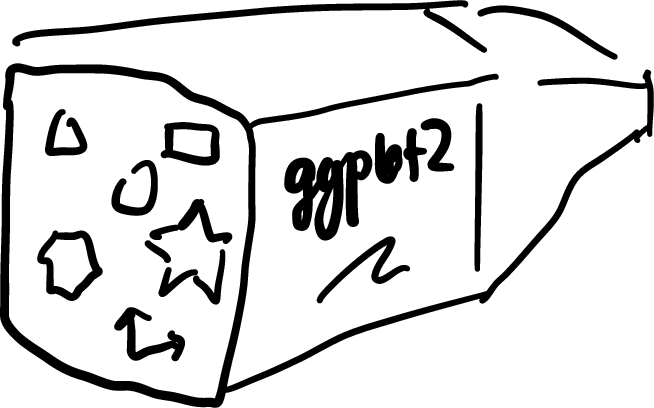

# The Backstory: calendars & ggplot2

## 

::: {.love-container}
{.headshot-circle fig-alt="Headshot of Cynthia Huang"}

:::

## 

::: {.love-container}
{.headshot-circle fig-alt="Headshot of Cynthia Huang"}

[❤️]{.love-heart}

{.hex-sticker fig-alt="ggplot2 hex sticker"}
:::

## 

::: {.love-container}
{.headshot-circle fig-alt="Headshot of Cynthia Huang"}

[💭]{.love-heart}


:::

::: {.notes}
So when I wanted to procrasti-plot a calendar of an upcoming research trip across Europe and USA two years ago instead of working on my thesis, I naturally searched for a ggplot2 extension
:::

##

<!--TODO: update to cynthia;s travel plans -->


##

<!--- TODO: make this bigger! -->

:::{.love-container}

:::

##

<!-- TODO: center veritcally -->

::: {.columns .cal-gallery}

::: {.column width="32%"}
### `{calendR}` {.smallest}

{fig-alt="Example calendR plot"}
:::

::: {.column width="32%"}
### `{ggweekly}` {.smallest}

{fig-alt="Example ggweekly plot"}

:::

::: {.column width="32%"}
### `{ggcal}` {.smallest}

{fig-alt="Example ggcal plot"}
:::

:::

##

::: {.columns .cal-interfaces}

::: {.column width="32%"}
### `{calendR}` {.smallest}

```r
calendR(
    year = format(Sys.Date(), "%Y"),
    month = NULL,
    from = NULL,
    to = NULL,
    start = c("S", "M"),
    orientation = c("portrait", "landscape"),
    title,
    title.size = 20,
    title.col = "gray30",
    subtitle = "",
    subtitle.size = 10,
    subtitle.col = "gray30",
    text = NULL,
    text.pos = NULL,
    text.size = 4,
    text.col = "gray30",
    special.days = NULL,
    special.col = "gray90",
    gradient = FALSE,
    low.col = "white",
    col = "gray30",
    lwd = 0.5,
    lty = 1,
    font.family = "sans",
    font.style = "plain",
    day.size = 3,
    days.col = "gray30",
    weeknames,
    weeknames.col = "gray30",
    weeknames.size = 4.5,
    week.number = FALSE,
    week.number.col = "gray30",
    week.number.size = 8,
    monthnames,
    months.size = 10,
    months.col = "gray30",
    months.pos = 0.5,
    mbg.col = "white",
    legend.pos = "none",
    legend.title = "",
    bg.col = "white",
    bg.img = "",
    margin = 1,
    ncol,
    lunar = FALSE,
    lunar.col = "gray60",
    lunar.size = 7,
    pdf = FALSE,
    doc_name = "",
    papersize = "A4"
)
```

:::

::: {.column width="32%"}
### `{ggweekly}` {.smallest}

```r
ggweek_planner(
    start_day = lubridate::today(),
    end_day = start_day +
        lubridate::weeks(8) - lubridate::days(1),
    highlight_days = NULL,
    week_start = c("isoweek", "epiweek"),
    week_start_label = c("month day", "week", "none"),
    show_day_numbers = TRUE,
    show_month_start_day = TRUE,
    show_month_boundaries = TRUE,
    highlight_text_size = 2,
    month_text_size = 4,
    day_number_text_size = 2,
    month_color = "#f78154",
    day_number_color = "grey80",
    weekend_fill = "#f8f8f8",
    holidays = ggweekly::us_federal_holidays,
    font_base_family = "PT Sans",
    font_label_family = "PT Sans Narrow",
    font_label_text = NULL
)
```
:::

::: {.column width="32%"}
### `{ggcal}` {.smallest}

```r
ggcal(dates, fills)
```

:::

:::

##

 TODO: insert interactive calendar screenshot

::: notes
so, I did end up procrasti-plotting an interactive calendar, that looks like this
:::

# Down the design rabbit hole...

##

 TODO: insert // confusion sketch

## 

TODO: dialogue sketch 1

## 

TODO: dialogue sketch 2 w/ Mitch avatar

##

::: {.love-container}


<!-- TODO: put box around helper machine to show selection! animate this last-->


<!-- TODO: replace with ggtime hex stick in greyscale -->

:::

##

::: {.love-container}
{.headshot-circle fig-alt="Headshot of Cynthia Huang"}

[🤔]{.love-heart}

{width="400px"}
:::

## 
::: {.columns}

::: {.column}

What would my ideal **reuseable-enough** helper do?

::: {.incremental }
* **Convenient** and quick 'autoplotting'
* Keep ggplot **flexibility** & error messages
* Play nice with **compatible** ggplot2 extensions
* **Minimise plot-specific arguments**
:::

:::

::: {.column}

::: {.sketch-container}
<!-- TODO: vertical center this figure -->

{fig-align="center" width="70%"}
:::

:::
:::

# From procrasti-plotting to procrasti-packaging

##

 TODO: ggtilecal screenshot

## 

TODO: replace with new summary image with SEPARATE, EXPOSE, DOCUMENT


## SEPARATE

::: {.columns}
::: {.column .smallest}
```{.r code-line-numbers="5-41|43-71|72-104|106-124" filename="very-long-ggplot-script.R"}
# source(here::here("_utilities/travel_dates_load.R"))
library(ggplot2)
library(ggiraph)

## ---- daily-loc-prep ----

## expand dates: https://stackoverflow.com/a/54728153

travel_days <- travel_dates |>
  mutate(nights = interval(startDate, endDate) / days(1)) |>
  arrange(startDate, desc(nights)) |>
  rowid_to_column() |>
  rowwise() |>
  reframe(rowid, location, details, nights,
    date = seq(startDate, endDate, by = "day")
  ) |>
  group_by(date) |>
  slice_min(order_by = nights, n = 1) |>
  ungroup() |>
  mutate(country = countrycode::countryname(location, "iso2c"))

away_days <- travel_days |>
  summarise(
    startDate = min(date),
    endDate = max(date)
  ) |>
  mutate(rowid = 0, location = "TBC") |>
  reframe(rowid, location, date = seq(startDate, endDate, by = "day"))

daily_loc <- away_days |>
  anti_join(travel_days, by = "date") |>
  bind_rows(travel_days) |>
  mutate(
    flag = countrycode::countrycode(country, "iso2c", "unicode.symbol"),
    continent = countrycode::countrycode(country, "iso2c", "continent")
  ) |>
  mutate(flag = case_when(
    location == "en route" ~ "\u2708",
    location == "TBC" ~ "❔",
    TRUE ~ flag
  ))

## ---- prep-full-calendar-data ----

# based on: https://github.com/nrennie/tidytuesday/blob/9dbe69d696f6c1edad41a72d157a42f3b5a63a81/2023/2023-03-07/20230307.R

# calculate extra months to make plot rectangular
cal_ncol <- 3
startMonth <- month(floor_date(min(travel_days$date), "month"))
endMonth <- month(ceiling_date(max(travel_days$date), "month") - 1)
n_extra_month <- cal_ncol - ((endMonth - startMonth + 1) %% cal_ncol)
padding_days <- summarise(
  travel_days,
  startDate = floor_date(min(date), "month"),
  endDate = ceiling_date(max(date) %m+% months(n_extra_month), "month") - 1
) |>
  reframe(date = seq(startDate, endDate, by = "day"))

# prepare calendar data
full_calendar <- padding_days |>
  anti_join(daily_loc, by = "date") |>
  bind_rows(daily_loc) |>
  mutate(
    Year = year(date),
    Month = month(date, label = TRUE),
    Day = wday(date, label = TRUE, week_start = 1),
    mday = mday(date),
    Month_week = (5 + day(date) +
      wday(floor_date(date, "month"), week_start = 1)) %/% 7
  )

## ---- travel-dates-calendar-display ----

base_data_aes <- full_calendar |>
  ggplot(aes(x = Day, y = Month_week))

layers_geom_text <- list(
  geom_text(aes(label = mday), nudge_y = 0.25),
  geom_text(aes(label = flag), nudge_y = -0.25)
)
layers_scale_coord <- list(
  scale_y_reverse(),
  coord_fixed(expand = TRUE)
)
layers_facet_labs <- list(
  facet_wrap(vars(Month),
    ncol = cal_ncol
  ),
  labs(y = NULL, x = NULL)
)
layers_theme <- list(
  theme_bw(),
  theme(
    plot.margin = margin(0, 0, 0, 0),
    panel.grid.major = element_blank(),
    panel.grid.minor = element_blank(),
    # panel.spacing = unit(0, "lines"),
    panel.border = element_blank(),
    axis.ticks = element_blank(),
    axis.text.y = element_blank(),
    strip.background = element_rect(fill = "grey95"),
    strip.text = element_text(hjust = 0)
  )
)

## ---- tooltip-travel-calendar ----

p_cal_girafe <- base_data_aes +
  geom_tile_interactive(
    aes(
      tooltip = paste(details, "@", location),
      data_id = location
    ),
    alpha = 0.2,
    fill = "transparent",
    colour = "grey80"
  ) +
  layers_geom_text +
  layers_scale_coord +
  coord_fixed(expand = FALSE) +
  layers_facet_labs +
  layers_theme

# girafe(ggobj = p_cal_girafe)
```

:::
::: {.column .small .incremental}

TODO: insert data prep, ggplot composer

:::
:::

::: {.notes}
- data wrangling:
    - reshaping via `reframe()`
    - creating new variables
    - fill in missing days
    - calculating facet and layout (e.g. `Month`, `Month_week`)
- `ggplot2` components:
    - `scale`, `coord` and `facet` to layout the calendar
    - `theme` modification to style the plot as a calendar
    - interactive `geom` from `{ggiraph}`
:::

## SEPARATE into MODULAR INTERNALS

::: {.columns}
::: {.column style="align-items: start;"}

::: {.sketch-container style="margin: 0; align-items: start;"}

TODO: REPLACE WITH blackbox modular

:::
:::
::: {.column .fragment}
```{.r code-line-numbers="1|2-5|7-19|1-22" filename="internals"}
gg_facet_wrap_months <- function(...){
  ## Data Helpers
  cal_data <- .events_long |>
    fill_missing_units({{ date_col }}) |>
    calc_calendar_vars({{ date_col }})

  ## Plot Construction
  base_plot <- cal_data |>
    ggplot2::ggplot(mapping = aes_string(
      x = "TC_wday_label",
      y = "TC_month_week",
      label = "TC_mday"
    )) +
    facet_wrap(c("TC_month_label"), axes = "all_x", nrow = nrow, ncol = ncol) +
    labs(y = NULL, x = NULL) +
    .geom +
    .scale_coord +
    .theme +
    .others

  base_plot
}
```
:::
:::

## EXPOSE

 TODO: insert image of transparent helper

## EXPOSE ggplot2 list defaults

```{.r code-line-numbers="1-5|6-9|10-20" filename="function-interface"}
gg_facet_wrap_months(
  ## --- data ----
  .events_long, 
  date_col,
  locale = NULL,
  ## --- facets / layout ----
  week_start = NULL, 
  nrow = NULL, 
  ncol = NULL,
  ## --- default layers ---
  .geom = list(
    geom_tile(color = "grey70", fill = "transparent"),
    geom_text(nudge_y = 0.25)
  ),
  .scale_coord = list(
    scale_y_reverse(),
    scale_x_discrete(position = "top"),
    coord_fixed(expand = TRUE)),
  .theme = list(theme_bw_tilecal()),
  .other = list()
)
```

## DOCUMENT

TODO: insert image with all three elements

## DOCUMENT customisation pointers

TODO: two column screenshots of documentation

# Reusing ggplot2 happily ever after?

##

TODO: insert recap animation 1

##

 TODO: insert recap animation 2

##

TODO: insert recap animation 3 arrow

## 

 TODO: insert ggtime summary 

## 

::: notes
for now, I hope my design for transparent helper functions is useful
:::

 TODO: insert summary slide again

## Thanks for listening!


::: {.columns}

::: {.column}

For more thoughts and ideas about reusing ggplot2 code:

 TODO: insert github repo link

* blog post comparing calendar extensions
* slides for this talk
* (untested) ggplot2 refactoring skill

:::

::: {.column .fragment}

Please tell me about your ggplot2 reuse experiences!

 TODO: insert QR-code

:::

:::